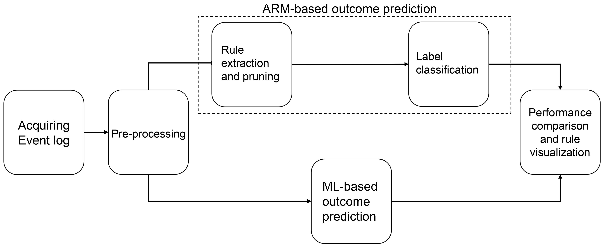

# Rule based predictive monitoring

This is the code associated to the paper:

**A rule-based framework for interpretablepredictions of business process outcomesusing event logs**
, Suhwan Lee, and Marco Comuzzi

## Framework
The research framwork is as follows



The framework consists of outcome prediction process using association rule mining and 
machine learning-based approach. The process handles from acquiring event log to 
rule visualization which is originated from association rules. 

The detailed content and explanation of each step are described in the paper.

## Dataset

Followings are datasets that used event log in this research.  
Each event log in data/dataset.zip contains label information which is generated with given rule.  
If a case satisfies the given rule, linear temporal logic, case label is 1, otherwise label is 0.

**BPIC 2011**  
F(ca-19.9 tumormarker) V F(ca-125 mbv meia)

**BPIC 2015_1~3**  
G(send conf irmation receipt) -> F(retrieve missing data))  

**Sepsis cases**  
Case without Activity _'Release A'_

## Code explanation

Brief description of uploaded files.

### Pre-processing
1. prefixlength_cut: Slice a eventlog by prefix length. Case length longer than given prefix length is considered.
2. indexbase&#46;py: With sliced event log, categorize case and event attributes in one-hot vector format.
3. trainsplit&#46;py: Split indexbase encoded event log to train and test datasets.  

### Machine leaerning
- randomforest&#46;py: Operate random forest algorithm with pre-processed datasets
- xgb_training.py: Operate Extreme gradient boosting model with pre-processed datasets

### Association rule mining
1. apriori&#46;py: Generate association rules from pre-processed event log using apriori or fpgrowth algorithm
2. filter&#46;py: Filter common rules across labels and remove
3. discover&#46;py: Combine files that contain association rules to one
4. comparions&#46;py: Generate and evaluate RSOP0,RSOP1,SBOP model for outcome prediction.
5. conviction&#46;py: Cluster and pick representative rules from all association rules using Kmeans clustering

## Repository Tree
```
📦rule-based-predictive-monitoring
 ┣ 📂association rule mining
 ┃ ┣ 📜apriori.py
 ┃ ┣ 📜comparison.py
 ┃ ┣ 📜conviction.py
 ┃ ┣ 📜discover.py
 ┃ ┗ 📜filter.py
 ┣ 📂data
 ┃ ┗ 📜dataset.zip
 ┣ 📂graph
 ┃ ┣ 📜drawgraph.ipynb
 ┃ ┗ 📜drawnetwork.ipynb
 ┣ 📂machine learning
 ┃ ┣ 📜randomforest.py
 ┃ ┗ 📜xgb_training.py
 ┣ 📂preprocessing
 ┃ ┣ 📜indexbase.py
 ┃ ┣ 📜prefixlength_cut.py
 ┃ ┗ 📜trainsplit.py
 ┗ 📜Readme.md
```